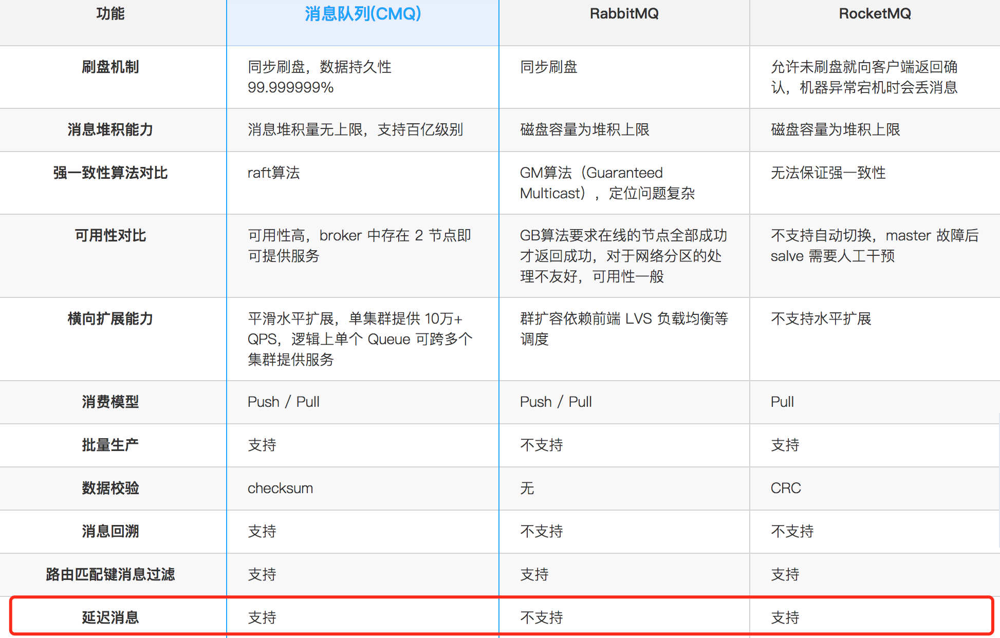
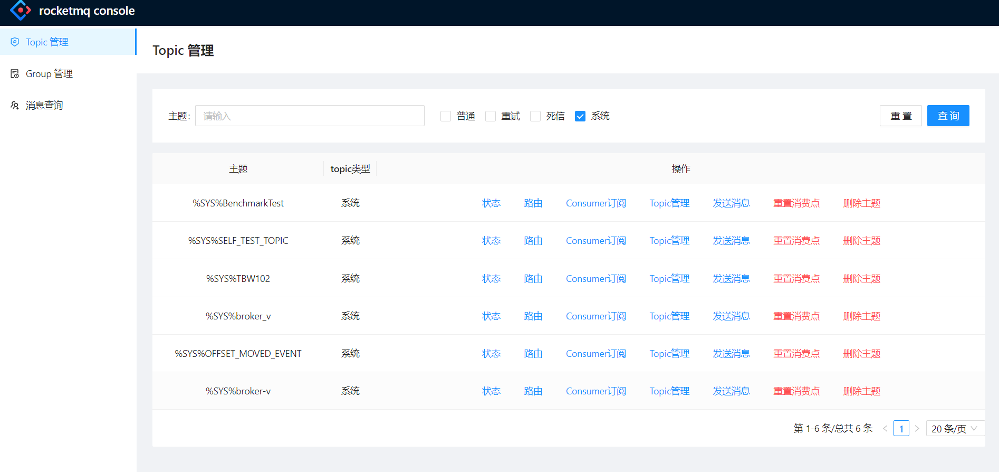
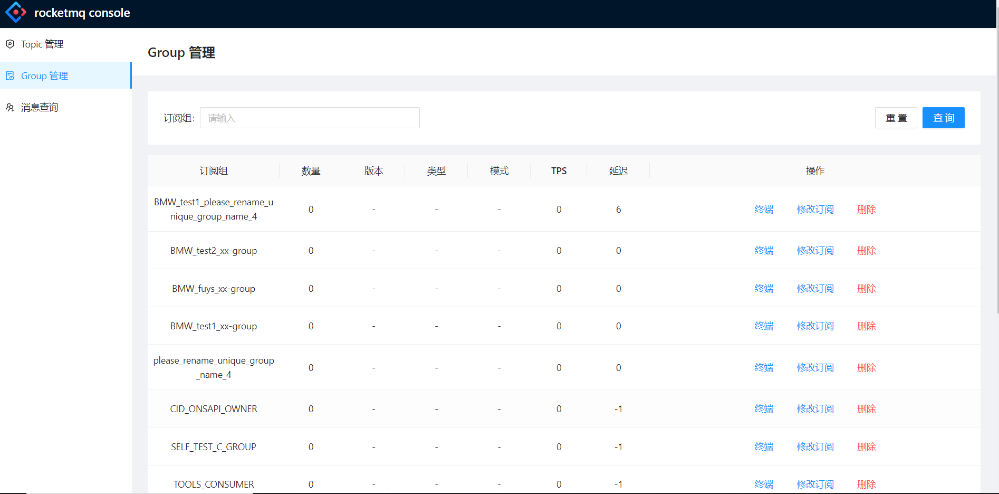
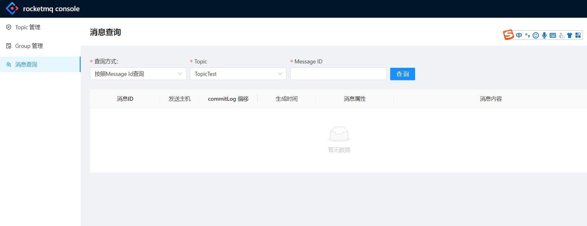

[](https://gitee.com/venus-suite/rocketmq-with-delivery-time) []() [](https://gitee.com/venus-suite/rocketmq-with-delivery-time) 
 [](https://gitee.com/venus-suite/rocketmq-with-delivery-time/stargazers) [](https://gitee.com/venus-suite/rocketmq-with-delivery-time/network/members)

## 概念介绍

#### 开源版本中，只有RocketMQ支持延迟消息，且只支持18个特定级别的延迟
#### 付费版本中，阿里云和腾讯云上的MQ产品都支持精度为秒级别的延迟消息




定时消息：Producer将消息发送到消息队列RocketMQ版服务端，但并不期望立马投递这条消息，而是推迟到在当前时间点之后的某一个时间投递到Consumer进行消费，该消息即定时消息。

延时消息：Producer将消息发送到消息队列RocketMQ版服务端，但并不期望立马投递这条消息，而是延迟一定时间后才投递到Consumer进行消费，该消息即延时消息。

定时消息与延时消息在代码配置上存在一些差异，但是最终达到的效果相同：消息在发送到消息队列RocketMQ版服务端后并不会立马投递，而是根据消息中的属性延迟固定时间后才投递给消费者。

## 实现原理（4种实现方案）
#### 1.代理实现 [链接](https://gitee.com/venus-suite/rocketmq-with-delivery-time/wikis/1.%E4%BB%A3%E7%90%86%E5%AE%9E%E7%8E%B0)
#### 2.时间轮和delay-commit-log实现 [链接](https://gitee.com/venus-suite/rocketmq-with-delivery-time/wikis/2.%E6%97%B6%E9%97%B4%E8%BD%AE%E5%92%8Cdelay-file%E5%AE%9E%E7%8E%B0)
#### 3.时间轮和时间file实现 [链接](https://gitee.com/venus-suite/rocketmq-with-delivery-time/wikis/3.%E6%97%B6%E9%97%B4%E8%BD%AE%E5%92%8C%E7%A7%92%E7%BA%A7%E6%96%87%E4%BB%B6%E5%AE%9E%E7%8E%B0)

#### 4.基于rocketmq 18个等级来改造 [链接](https://gitee.com/venus-suite/rocketmq-with-delivery-time/wikis/4.%E5%9F%BA%E4%BA%8Erocketmq%20%E9%BB%98%E8%AE%A4%E6%94%AF%E6%8C%8118%E4%B8%AA%E7%AD%89%E7%BA%A7%E6%9D%A5%E6%94%B9%E9%80%A0?sort_id=5071802)


## 适用场景

定时消息和延时消息适用于以下一些场景：

消息生产和消费有时间窗口要求，例如在电商交易中超时未支付关闭订单的场景，在订单创建时会发送一条延时消息。

这条消息将会在30分钟以后投递给消费者，消费者收到此消息后需要判断对应的订单是否已完成支付。

如支付未完成，则关闭订单。如已完成支付则忽略。

通过消息触发一些定时任务，例如在某一固定时间点向用户发送提醒消息。

使用方式
定时消息和延时消息的使用在代码编写上存在略微的区别：

发送定时消息需要明确指定消息发送时间点之后的某一时间点作为消息投递的时间点。

发送延时消息时需要设定一个延时时间长度，消息将从当前发送时间点开始延迟固定时间之后才开始投递。

### 注意事项
定时消息的精度会有1s~2s的延迟误差。

定时和延时消息的msg.setStartDeliverTime参数需要设置成当前时间戳之后的某个时刻（单位毫秒）。

如果被设置成当前时间戳之前的某个时刻，消息将立刻投递给消费者。

定时和延时消息的msg.setStartDeliverTime参数可设置40天内的任何时刻（单位毫秒），超过40天消息发送将失败。

StartDeliverTime是服务端开始向消费端投递的时间。如果消费者当前有消息堆积，那么定时和延时消息会排在堆积消息后面，将不能严格按照配置的时间进行投递。

由于客户端和服务端可能存在时间差，消息的实际投递时间与客户端设置的投递时间之间可能存在偏差。

## 如何使用
推荐使用阿里云提供的rocketmq版本的pom

```java
       <dependency>
            <groupId>com.aliyun.openservices</groupId>
            <artifactId>ons-client</artifactId>
            <version>1.8.4.Final</version>
        </dependency>

```

#### 消息发送


```java

import com.aliyun.openservices.ons.api.*;
import com.aliyun.openservices.shade.org.apache.commons.lang3.time.DateFormatUtils;

import java.util.Date;
import java.util.Properties;

public class ProducerDelayTest {
    public static void main(String[] args) {
        Properties properties = new Properties();
        // AccessKey ID阿里云身份验证，在阿里云RAM控制台创建。
        properties.put(PropertyKeyConst.AccessKey, "XXX");
        // AccessKey Secret阿里云身份验证，在阿里云RAM控制台创建。
        properties.put(PropertyKeyConst.SecretKey, "XXX");
        // 设置TCP接入域名，进入消息队列RocketMQ版控制台实例详情页面的接入点区域查看。
        properties.put(PropertyKeyConst.NAMESRV_ADDR, "localhost:9876");
        

        Producer producer = ONSFactory.createProducer(properties);
        // 在发送消息前，必须调用start方法来启动Producer，只需调用一次即可。
        producer.start();

         {
            Message msg = new Message(
                    // 您在消息队列RocketMQ版控制台创建的Topic。
                    "TopicTest",
                    // Message Tag,可理解为Gmail中的标签，对消息进行再归类，方便Consumer指定过滤条件在消息队列RocketMQ版服务器过滤。
                    "TagA",
                    // Message Body可以是任何二进制形式的数据，消息队列RocketMQ版不做任何干预，需要Producer与Consumer协商好一致的序列化和反序列化方式。
                    "演示15秒钟>>> ".getBytes());
            // 设置代表消息的业务关键属性，请尽可能全局唯一。
            // 以方便您在无法正常收到消息情况下，可通过控制台查询消息并补发。
            // 注意：不设置也不会影响消息正常收发。
            msg.setKey("ORDERID_100e");
            try {
                // 延时消息，单位毫秒（ms），在指定延迟时间（当前时间之后）进行投递，例如消息在15秒后投递。
                long delayTime = System.currentTimeMillis() + 15000;
                System.out.println("发送时间>>" + DateFormatUtils.format(new Date(), "yyyy-MM-dd HH:mm:ss"));

                // 设置消息需要被投递的时间。
                msg.setStartDeliverTime(delayTime);

                SendResult sendResult = producer.send(msg);
                // 同步发送消息，只要不抛异常就是成功。
                if (sendResult != null) {
                    System.out.println(DateFormatUtils.format(new Date(), "yyyy-MM-dd HH:mm:ss") + " Send mq message success. Topic is:" + msg.getTopic() + " msgId is: " + sendResult.getMessageId());
                }
            } catch (Exception e) {
                // 消息发送失败，需要进行重试处理，可重新发送这条消息或持久化这条数据进行补偿处理。
                System.out.println(new Date() + " Send mq message failed. Topic is:" + msg.getTopic());
                e.printStackTrace();
            }
        }
        // 在应用退出前，销毁Producer对象。
        // 注意：如果不销毁也没有问题。
        producer.shutdown();
    }
}           


```

#### 消息接收


```java

import com.aliyun.openservices.shade.org.apache.commons.lang3.time.DateFormatUtils;
import org.apache.rocketmq.client.consumer.DefaultMQPushConsumer;
import org.apache.rocketmq.client.consumer.listener.ConsumeConcurrentlyContext;
import org.apache.rocketmq.client.consumer.listener.ConsumeConcurrentlyStatus;
import org.apache.rocketmq.client.consumer.listener.MessageListenerConcurrently;
import org.apache.rocketmq.client.exception.MQClientException;
import org.apache.rocketmq.common.consumer.ConsumeFromWhere;
import org.apache.rocketmq.common.message.MessageExt;

import java.util.Date;
import java.util.List;

/**
 * This example shows how to subscribe and consume messages using providing {@link DefaultMQPushConsumer}.
 */
public class Consumer {

    public static void main(String[] args) throws InterruptedException, MQClientException {

        /*
         * Instantiate with specified consumer group name.
         */

        final int[] totals = {0};
        DefaultMQPushConsumer consumer = new DefaultMQPushConsumer("please_rename_unique_group_name_4");

        consumer.setNamesrvAddr("localhost:9876");
        /*
         * Specify name server addresses.
         * <p/>
         *
         * Alternatively, you may specify name server addresses via exporting environmental variable: NAMESRV_ADDR
         * <pre>
         * {@code
         * consumer.setNamesrvAddr("name-server1-ip:9876;name-server2-ip:9876");
         * }
         * </pre>
         */

        /*
         * Specify where to start in case the specified consumer group is a brand new one.
         */
        consumer.setConsumeFromWhere(ConsumeFromWhere.CONSUME_FROM_FIRST_OFFSET);

        /*
         * Subscribe one more more topics to consume.
         */
        consumer.subscribe("TopicTest", "*");

        /*
         *  Register callback to execute on arrival of messages fetched from brokers.
         */
        consumer.registerMessageListener(new MessageListenerConcurrently() {

            @Override
            public ConsumeConcurrentlyStatus consumeMessage(List<MessageExt> msgs,
                                                            ConsumeConcurrentlyContext context) {
                System.out.println("接收到消息："+ DateFormatUtils.format(new Date(),"yyyy-MM-dd HH:mm:ss"));
                System.out.printf("%s Receive New Messages: %s %n", Thread.currentThread().getName(), msgs);
                for(MessageExt m: msgs){
                  System.out.println(">>>"+new String(  m.getBody()));
                }
                totals[0] +=1;
                System.out.println(">>>>>total="+ totals[0]);
                return ConsumeConcurrentlyStatus.CONSUME_SUCCESS;
            }
        });

        /*
         *  Launch the consumer instance.
         */
        consumer.start();

        System.out.printf("Consumer Started.%n");
    }
}


```
### 如何使用社区版本的rocketmq 发送延迟消息

```java
 /*设置为您在消息队列RocketMQ版控制台创建的Topic。*/
                Message msg = new Message("YOUR TOPIC",
                    /*设置消息的Tag。*/
                    "YOUR MESSAGE TAG",
                    /*消息内容。*/
                    "Hello world".getBytes(RemotingHelper.DEFAULT_CHARSET));
                /*发送延时消息，需要设置延时时间，单位毫秒（ms），消息将在指定延时时间后投递，例如消息将在3秒后投递。*/
                long delayTime = System.currentTimeMillis() + 3000;
                msg.putUserProperty("__STARTDELIVERTIME", String.valueOf(delayTime));
      
                /**
                *若需要发送定时消息，则需要设置定时时间，消息将在指定时间进行投递，例如消息将在2021-08-10 18:45:00投递。
                *定时时间格式为：yyyy-MM-dd HH:mm:ss，若设置的时间戳在当前时间之前，则消息将被立即投递给Consumer。
                * long timeStamp = new SimpleDateFormat("yyyy-MM-dd HH:mm:ss").parse("2021-08-10 18:45:00").getTime();
                * msg.putUserProperty("__STARTDELIVERTIME", String.valueOf(timeStamp));
                */
                SendResult sendResult = producer.send(msg);
                System.out.printf("%s%n", sendResult);

```


## 完善的UI管理
### topics管理


### group管理


### 消息管理


### 联系我们


